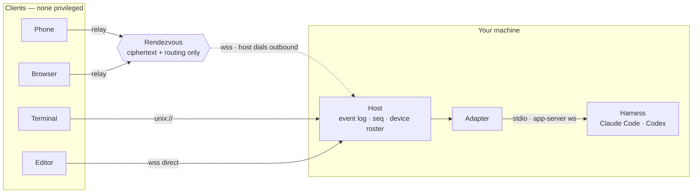

# HCP — Harness Control Protocol

An open protocol for **attaching to, steering, and approving work in a running coding-agent
session** — from another process, another machine, or a phone.

> **Status:** draft `v0.1`. Nothing here is stable yet. See [`docs/prior-art.md`](docs/prior-art.md)
> for the landscape review this design came out of.

## The problem

Claude Code and Codex have each built a remote-control system: a local daemon, a
bidirectional message stream, an outbound relay to get past NAT, device pairing, and
multi-client session sync. They arrived at the same seven-piece architecture
independently, and neither is usable by anyone else.

So the shipping third-party mobile clients drive these agents by injecting keystrokes into
tmux and screen-scraping the terminal. That is the state of the art for cross-harness
control in 2026.

## Shape

Three properties the picture is making:

- **No privileged client.** The terminal on the machine and the phone on the sofa are the
  same kind of peer. Borrowed from `codex --remote`: once the local UI has a private back
  door, every remote feature is second-class forever.
- **The Host dials out.** No inbound port is opened on the developer's machine, which is how
  Claude Code's outbound-polling design gets through NAT too.
- **The Rendezvous is optional and blind.** `unix://` and direct `wss` skip it entirely, and
  where it is used it carries an encrypted channel it cannot read.

Only three things are per-harness — the transport to the harness, the classifier that turns
a raw approval payload into a one-line summary and a risk grade, and the event-kind mapping.
Everything else is shared.

## What HCP is not

- **Not MCP.** MCP connects an agent to tools. HCP connects a *human* to an agent.
- **Not ACP.** [ACP](https://agentclientprotocol.com) got the vocabulary right, and HCP
  reuses it deliberately. But ACP assumes the agent is a subprocess the editor spawned over
  stdio. HCP is what you need when the agent is on a machine you are not sitting at.
- **Not UHP.** [UHP](https://unifiedharnessprotocol.org) is a dispatch API — submit a task,
  stream the result. HCP is a control plane — attach to work already in flight and answer
  the questions it asks you. See [`docs/prior-art.md`](docs/prior-art.md#5-uhp).

## The four things HCP adds

| | Why nothing else has it |
|---|---|
| **Session attach with replay** | ACP is one client, one subprocess. UHP threads turns but has no live session to join. HCP gives every event a per-session `seq` so a client that slept through a tunnel outage resumes exactly where it stopped. |
| **A phone-sized permission envelope** | Both vendors carry rich approval payloads built for a 27-inch display. HCP normalizes them into one envelope that *must* carry a one-line summary and a risk grade, because that is what fits on a lock screen. |
| **Keypair device pairing** | Both vendors use bearer tokens. HCP enrolls a device keypair, so a leaked relay token cannot impersonate your phone. |
| **A relay that cannot read your code** | Anthropic's relay is Anthropic-only, OpenAI's is OpenAI-only, and both are trusted with plaintext — reasonably, since the model already sees the code. A *neutral* relay has no such trust, so HCP's is end-to-end encrypted and sees only ciphertext and routing metadata. |

## Spec

| Document | Contents |
|---|---|
| [`spec/v0.1/README.md`](spec/v0.1/README.md) | Roles, architecture, design principles, method index |
| [`spec/v0.1/transport.md`](spec/v0.1/transport.md) | Framing, stdio / unix / ws / relay transports |
| [`spec/v0.1/sessions.md`](spec/v0.1/sessions.md) | Lifecycle, attach, `seq` cursors, replay, multi-client concurrency |
| [`spec/v0.1/permissions.md`](spec/v0.1/permissions.md) | The approval envelope — the interop core |
| [`spec/v0.1/pairing-and-relay.md`](spec/v0.1/pairing-and-relay.md) | Device enrollment, rendezvous, end-to-end encryption |
| [`spec/v0.1/capabilities.md`](spec/v0.1/capabilities.md) | Negotiation and graceful degradation |
| [`schema/hcp-v0.1.schema.json`](schema/hcp-v0.1.schema.json) | JSON Schema for the load-bearing message types |
| [`docs/adapter-mapping.md`](docs/adapter-mapping.md) | Concrete mapping to Claude Code and Codex |

## Conformance targets

Both are reachable today without vendor cooperation, which is the point.

- **Codex** — `codex app-server --listen ws://` already has the right shape. The adapter is
  mostly renaming.
- **Claude Code** — wrap `claude --input-format stream-json --output-format stream-json
  --permission-prompt-tool stdio`.

The standard is proven when one mobile client drives both, and no tmux is involved.

## Name

Originally drafted as HTP, *Harness Transport Protocol*. Renamed because "transport" named
the wrong layer — transports move bytes, and Codex already has three of them; this spec
describes what rides on top. The acronym was also one keystroke from HTTP, in a space where
[UHP](https://unifiedharnessprotocol.org) already occupies "Harness … Protocol".

"Control" is the word Anthropic and OpenAI each landed on independently for this exact
feature — `claude remote-control`, `codex remote-control`, `remoteControl/status/changed` —
so the name arrives in vocabulary the audience already has.

## License

Apache-2.0 (intended). Spec text is offered for implementation by anyone, including the
vendors it describes.
